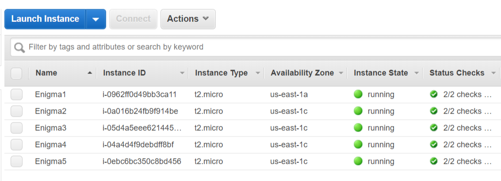

# **Enigma Machine**

>Enigma Machine

## Encryption

#### Input Format
The input begin with three positive integer ***r<sub>i</sub>***, which specifies the ***i***th rotary. Next line has a three-uppercase-letter string, each of the letter represents the ***i***th rotary setting. The last line contains a string ***p***, the plaintext you have to encrypt.

#### Output Format
The output is only one line with the ciphertext which you encypted from plaintext.

#### Technical Specification
- 1  ≤ ***i*** ≤ 5

#### Sample Input:
> 3 2 1  
> XDH  
> ABCDEFGHIJKLMNOPQRSTUVWXYZ

#### Sample Output:
>KQGJALNNGTESJCXFSWEYLSNCIW

## Decryption

Modifiy the function `decrypt()` to choose the way to decrypt.
```c++
// Usage 1
selectedRol.push_back(4);
chooseRotary(3);

// Usage 2
selectedRol.push_back(1);
selectedRol.push_back(2);
selectedRol.push_back(3);
rotateRotary();
```
- Usage 1: Execute after fixed the first rotary number and iterating the others rotary.
- Usage 2: Fixed all of three rotary number and directly execute the rotate function. This means that only decrypt the only one case of the order of rotary.

### Execute
```
> g++ -O3 -std=c++17 Enigma.cpp -o Enigma.out -mavx2
> Enigma.out -d
```
Remember that use the `-O3` optimization to maximal the speed of executing.

### Result
All of the results will be write into `ans.txt` with append mode (if ans.txt does not exist, it will be generated automatically). Copy the plugboard result and paste it to the string constant at line 69 in `Rotate.cpp`.

### Cloud Computing
We use the AWS EC2 instance to perform decryption. With five instances with t2.micro, expected in 25 days can finish all of the decryption. Despite the slow decryption speed, we can use a multi-thread for maximum decryption speed if we have multi-core in the other instance type except for t2.micro. Of course, we use t2.micro because it is free.



```
123
14 5 15
OFP
IL MQ KG EJ PR TV
YFCFBCLODNKEECFSOAZGCFXQDLCQSQZPKOCXXXRGLDAOJEPPSHFINSOXGKX
TIHSCDDNMWPFWQWVPGFHRIGUKZWDQLSXPJVCFAVPRORQBITXKYAQDDXVIMX
FUHMVRMJVSSZHDMDXULSHEILHITLER

124
20 9 21
UJV
IW OQ DG CJ KL TU
KJZQOVJIDCAAIAMZUBUKBEBKGBAFTVOIOSPEPHMRBJVBSWKQJKQMABPGKOR
YRNXHPYBVXWBXQTJKDGAQFJMNZUXSZXMXOHJUARHEXCQCWSIGPDAZPOQUGV
BDQTJVUTPZRIJWBOQZPJHEILHITLER

215
5 15 10
FPK
HS NL KU AE MO VZ
PZJKGLGZVVIWHPFQVAAVUGGKFRZBXVIRDTRIRHXIVVCXMEMAXESPVGDCVDD
ZIWAFZMECMMAWZADKPLLQSMTPGKDSVJPTMTCHWXKTLYGGLZIFFOEIDGUQGD
VLMDIVYOWHJSNGNDIXJDHEILHITLER

315
8 21 21
IVV
ID FH UQ EG LT VX
POVSTTLVKMMSFYCGTRSGVJWAMDHCDQVFQSKIJEGLWFTWUMNWUTYXPVZVTEZ
PNTRHNBQTSXJPTEUWZKTDZORAXQKHXDRHLCQVZFRXSSYOFPUHWDTKQINTNQ
QPNMDRMISCZAMJGADLONHEILHITLER

324
24 7 24
YHY
IC PH AQ BE FL XY
THEBFAVOMAMBAIGSANGVNGUSBNENIOEPUJDENQHMNOQHTHEALNKUNCEDJIP
RRTUROMENTVYDVAHKNUGNDSMWAYVDHHIFKPKSHICWITHRESKRTERPINATKP
TGAMESRXTPCKNLERFNCTHEILHITLER

345
25 2 22
ZCW
IW LH BQ AC EN PT
LYDYWNPAADSPCDCWQLOBOCHXXYGYKYCOLGVCHCCWUNXIAPWKDJQVLFFPBBR
NNQXVDVBQPQYKALWITCJPLFLOSJBJGUGXBERUDDSRVNNZMURXPPZWOMKXLO
GNLRNYRPWHBLOJCAPSWXHEILHITLER

435
9 1 3
JBD
IK LH JQ NG MS TY
NNBNHEIQDUWMACAZNAAYVOBYHHCSCNJTGPAPRZGTFMYPAYOAQOXUOXZCRDW
BABPMURAPCISLRDYVDEKMKXZDNGKBPPRMSENSEIJIVLYGAOJRRDPWXVLKSU
UQOAAAHIALYJKDPYFNOGHEILHITLER

512
18 9 10
SJK
HQ SL FU AC VX YZ
VDZXPDHWYNTJAELRTKVUXRJTKDDGSTTQPNLGEGGGMUDLRCLXVKTLSVAAKXO
NSPRDFLLXHPZFXHTGDYBOANHIHPZOHKETIEAILNMTPHVTDXVZKAEOYRUXKG
KYBGDRBMJFZVZDJEZPOCHEILHITLER

531
0 20 18
AUS
HG YL KU CN QS TZ
AIVEJTSXFUWKUWWIUJLQZYADISUSLSVUIMYBMKBRVNQZEWSNZACJJGIGMUM
EJIFECZMMNPEKXGUEYCKGCKZJIZOFYJROXAOFGFTVQULDYTAMWCHWKRRQLR
SDAJHOWMBJLWERVRWVDMHEILHITLER

542
16 12 6
QMG
IL VH BQ AC EF RX
HJPDSSVLHZFYSBGFLHUSWBASHKLBHXZLHRVKFZCVHWWGJQYRYUEJJNMEYWV
WJIPLTOVENBAMODLEGBXKDBGVMCVXGSJTGLWSJXXAVDLPRDFSIHZJYRXJEG
ZHMXUEAGRYBEBGBIVWIUHEILHITLER
```

## Contribution
[click me](https://hackmd.io/@zg9RmrK1SoeV3uORWpfXKA/HJkI0QeuH)
